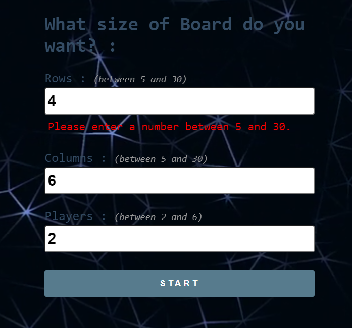
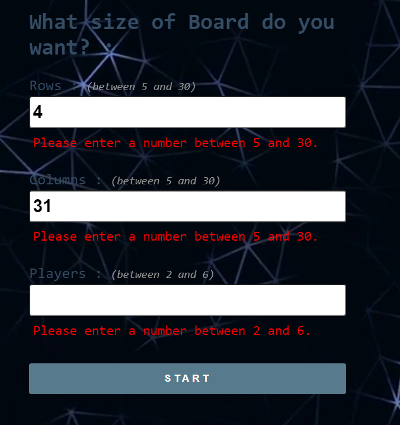
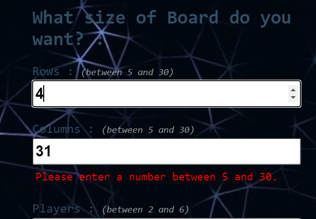

## PR Description 📜

Please include summary related to the issue you have fixed and describe your PR in brief over here by specifying the issue number on which you were working below
Fixes # 125

Form Validation has been implemented succesfully.
The game shows warning to the user if he/she enter the values outside the contraints and prevents the starting the game.

 
## Mark the task you have completed ✅

<!----Please delete options that are not relevant. In order to tick the check box just put x inside them for example [x] like this----->

- [x] I follow [CONTRIBUTING GUIDELINE](https://github.com/GameSphere-MultiPlayer/Community-Page/blob/main/.github/CONTRIBUTING_GUIDELINE.md) & [CODE OF CONDUCT](https://github.com/GameSphere-MultiPlayer/Community-Page/blob/main/.github/CODE_OF_CONDUCT.md) of this project.
- [x] I have performed a self-review of my own code or work.
- [x] I have commented my code, particularly in hard-to-understand areas.
- [x] I have followed proper naming convention showed in [CONTRIBUTING GUIDELINE](https://github.com/GameSphere-MultiPlayer/Community-Page/blob/main/.github/CONTRIBUTING_GUIDELINE.md)
- [x] I have added screenshot for review.

## Add your screenshots(Optional) 📸

--- 
 

## Thank you soo much for contributing to our repository 💗