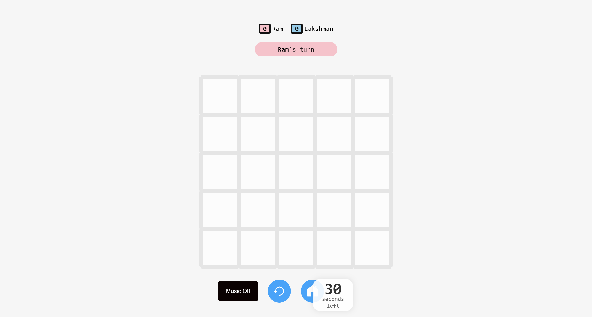
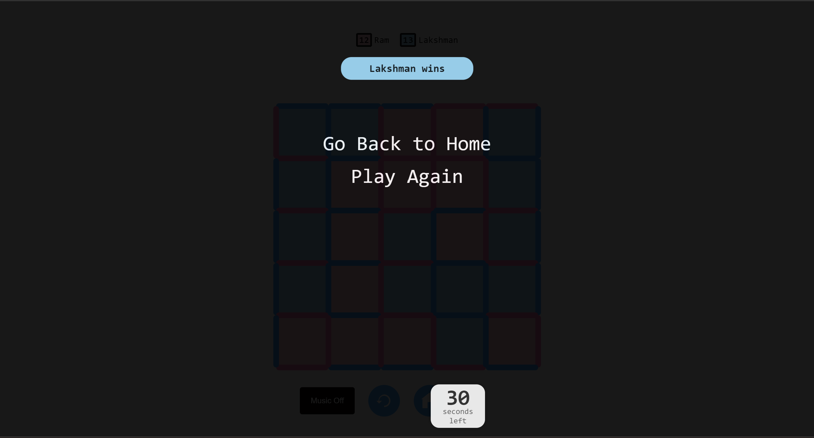

# __Dots and Boxes Game__ - [Join our Community on Discord](https://discord.gg/2HTCFrSvPB)


---
<table align="center">
    <thead align="center">
        <tr border: 1px;>
            <td><b>Stars</b></td>
            <td><b>Forks</b></td>
            <td><b>Issues</b></td>
            <td><b>Open PRs</b></td>
            <td><b>Closed PRs</b></td>
        </tr>
     </thead>
    <tbody>
         <tr>
            <td></td>
             <td></td>
            <td></td>
            <td></td>
           <td></td>
        </tr>
    </tbody>
</table>

## **Tech Stack**
- HTML
- CSS
- Javascript

## **Description 📃**
- It is a multiplayer game.
- Based on the lines connected, the boxes would be coloured.
- The one with maximum number of boxes would be the winner.

## **Functionalities 🎮**
- It is a multiplayer game.
- The player has to select the lines. The one with the line at the last would fill the connecting boxes.
- The player with the maximum boxes covered would be the winner.
- The size of the board can be adjustable by user.
- Players will switch after every turn. But the player who has filled the last box, will get one extra chance consecutively.

## **How to play? 🕹️**

- User has to click on edge in such a way that it will maximise the number of boxes based on the lines connected and the number of adjacent boxes.

<br>

## **Setup and Installation**
<p style="font-family:var(--ff-philosopher);">To contribute to the Dot-Box repository, follow these steps:</p>

1. **Fork the Repository:**
   Click on the "Fork" button on the repository's GitHub page to create a copy of the repository in your GitHub account.

2. **Clone the repository:**
   Clone the forked repository to your local machine using the following command in your terminal.
   ```bash
   git clone https://github.com/<your-github-username>/Dot-Box
   ```
3. **Go to Dot-Box Folder**
     ```
    cd Dot-Box
    ```
4. **Add a remote upstream:**
   ```bash
   git remote add upstream https://github.com/ChromeGaming/Dot-Box
   ```
5. **Create a new branch:**
   Create a new branch for your changes. Run the following command in your terminal.
   ```bash
   git checkout -b <your-branch-name>
   ```
6. **Make the desired changes:**
   Make the desired changes to the source code.
   6. **Add your changes:**
   Add your changes to the staging area. Run the following command in your terminal.
   ```bash
   git add <File1 changed> <File2 changed> ...
   ```
7. **Commit your changes:**
   Commit your changes with a meaningful commit message. Run the following command in your terminal.
   ```bash
   git commit -m "<your-commit-message>"
   ```
8. **Push your changes:**
   Push your changes to your forked repository. Run the following command in your terminal
   ```bash
   git push origin <your-branch-name>
   ```
9. **Create a Pull Request:**
   Go to the GitHub page of your forked repository. You should see a prompt to create a pull request (PR). Click on it, compare the changes, and create the PR.
<br>


## **Screenshots 📸**

Before Starting Game

<br>

After Winning Game


<br>

## **Working video 📹**

https://github.com/GameSphere-MultiPlayer/GameSphere/assets/114330097/293120ab-b1f0-48a8-af15-c05d49c65763

<br>

## **Our Contributors**
<a href="https://github.com/ChromeGaming/Dot-Box/graphs/contributors">
  
</a>
